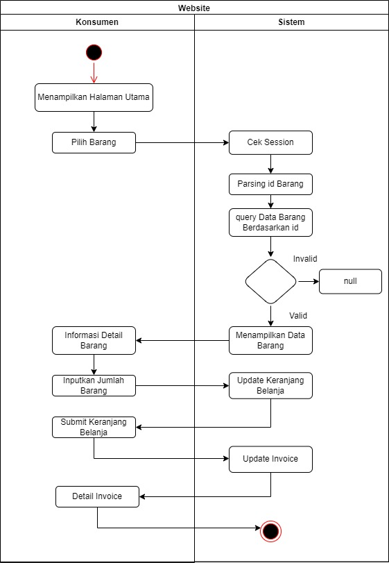

# RPL-3 
|**Nama**|**NIM**|**Kelas**|**Matkul**|
|----|---|-----|------|
|Muhammad Fiqri Setyoadi|312210062|TI.22.A.2|Rekayasa Perangkat Lunak|

1. Toko Parfume berbasis Web
    ### Analisanya:

    Permasalahannya:
    - Manajemen Inventori
    - Pengelolaan Pemesanan dan Pembayaran
    - Antarmuka Pengguna dan Pengalaman Pengguna
    - Keamanan dan Privasi

    Kebutuhan Sistemnya:
    - Sistem manajemen inventori yang canggih untuk memantau, mengelola, dan memperbarui stok secara real-time.
    - Sistem manajemen pesanan yang terintegrasi dengan sistem pembayaran online yang aman dan efisien.
    - Antarmuka pengguna yang intuitif, responsif, dan efisien untuk memudahkan navigasi dan meningkatkan pengalaman pengguna.
    - Perlindungan data yang kuat, enkripsi, keamanan transaksi.

2. UseCase Diagram

3. Activity Diagram
    #### Activity diagaram pencarian barang
    
    ### Activity diagaram order barang
    
    ### Activity diagram Validalasi Pembayaran
    

4. Squence Diagram
    ### Squence digram pencarrian barang
    
    ### Squence diagram order barang
    
    ### Squence validalasi pembayaran
    

5. Class Diagram

### Mungkin hanya ini saja, kurang lebihnya saya mohon maaf atas segala kekurangan yang ada pada diri saya 🙏 🎓
